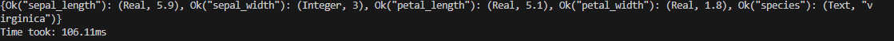

# Mini-Project 8: Rust Python Comparison

In this project, we took a Python script that runs a query on an SQLite database, and completely rewrote it in Rust. Then, in order to highlight improvements, we recorded how fast it took for both entire scripts to execute. The results are shown below.

# What both scripts do
Both scripts create an SQLite database off of the Iris.csv data. Then, both will query from the database and output the results. The following below are the different times.

### Rust Timing

### Python Timing
